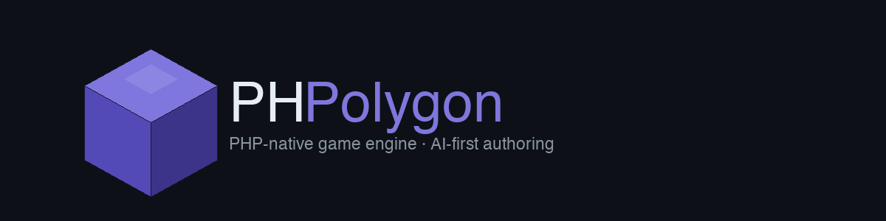

<p align="center">
  
</p>

<p align="center">
  <strong>PHP-native game engine with AI-first authoring</strong>
</p>

<p align="center">
  <a href="#features">Features</a> ·
  <a href="#architecture">Architecture</a> ·
  <a href="#getting-started">Getting Started</a> ·
  <a href="#examples">Examples</a> ·
  <a href="#roadmap">Roadmap</a>
</p>

---

PHPolygon is a standalone game engine written entirely in PHP. It uses
[php-vio](https://github.com/hmennen90/php-vio) as its primary unified backend
for window management, input, audio, and 2D/3D rendering. When php-vio is not
available, it falls back to [php-glfw](https://github.com/mario-deluna/php-glfw)
(OpenGL 4.1 / NanoVG) and [php-vulkan](https://github.com/hmennen90/php-vulkan)
for 3D graphics. The primary authoring tool is Claude Code — scenes, components,
and game logic are generated and iterated on through AI-assisted workflows.

## Features

- **Hybrid ECS** — Entities as PHP objects, Components with lifecycle hooks
  (`onAttach`, `onUpdate`, `onDetach`), Systems for cross-entity logic
- **Attribute-driven serialization** — `#[Property]`, `#[Range]`, `#[Hidden]`,
  `#[Serializable]` on component fields, zero manual `toJson()`/`fromJson()`
- **Scene system** — PHP-canonical scene definitions, SceneManager with
  single/additive loading, parent-child entity hierarchy, persistent entities
- **Prefabs** — Reusable entity templates as PHP classes
- **PHP ↔ JSON transpiler** — Bidirectional conversion for the editor pipeline;
  PHP is always the source of truth, JSON is the intermediate format
- **Physics** — RigidBody2D, BoxCollider2D, AABB collision detection + response,
  raycasting, trigger/collision events
- **Input mapping** — Action-based system with named bindings (`jump`, `shoot`)
  instead of raw key codes, axis support for movement
- **Audio** — AudioManager with channel-based mixing (SFX, Music, UI, Ambient,
  Voice), per-channel volume/mute, pluggable backend interface
- **Localization** — LocaleManager with JSON translation files, dot-notation keys,
  placeholder replacement (`:param`), fallback locale
- **Save system** — Slot-based SaveManager with metadata, play time tracking,
  JSON persistence
- **UI system** — Dual-paradigm: immediate-mode (UIContext) for debug overlays,
  retained-mode (Widget tree) for complex UIs with measure/layout/draw pipeline
- **Editor infrastructure** — Inspector metadata extraction via Reflection,
  component registry with category grouping, SceneDocument with undo/redo,
  command bus for editor operations, NativePHP desktop app with Vue 3 SPA
- **Build system** — 7-phase pipeline producing standalone executables: PHAR
  creation, static PHP binary (micro.sfx), platform packaging (macOS .app,
  Linux, Windows), plus a native iOS/iPadOS `.app` via embed libphp.a + Xcode
- **Headless mode** — Full engine without GPU: `EngineConfig(headless: true)`
  swaps in NullWindow, NullRenderer2D, NullTextureManager for CI/testing
- **Visual regression testing** — Playwright-style VRT with GD software renderer,
  YIQ pixel comparison, automatic snapshot management, diff image generation
- **Math primitives** — Vec2, Vec3, Mat3, Rect as immutable value objects
- **Rendering** — Vio unified backend (primary), NanoVG 2D fallback, Vulkan/Metal/OpenGL 3D,
  Camera2D, TextureManager, SpriteSheet
- **Splash screen** — Engine-branded "Developed with PHPolygon" splash at startup
  with fade animation, renderer info display, configurable duration, skippable

## Architecture

```
PHPolygon\
├── ECS\              Entity, World, Component/System interfaces, Attributes
├── Scene\            Scene, SceneManager, SceneBuilder, Prefabs, Transpiler
├── Component\        Transform2D, SpriteRenderer, RigidBody2D, BoxCollider2D, ...
├── System\           Physics2DSystem, Renderer2DSystem, AudioSystem, InputMapSystem
├── Rendering\        VioRenderer2D, Renderer2D (NanoVG), VioRenderer3D, OpenGLRenderer3D,
│                     VulkanRenderer3D, MetalRenderer3D, NullRenderer2D/3D, Camera2D,
│                     VioTextureManager, TextureManager, Color
├── Runtime\          VioWindow, Window (GLFW), NullWindow, GameLoop, VioInput, Input, Clock
├── Physics\          Collision2D, RaycastHit2D
├── Input\            InputMap, InputAction, InputBinding
├── Audio\            AudioManager, AudioChannel, AudioBackendInterface
├── Locale\           LocaleManager (i18n with JSON files, fallback locale)
├── SaveGame\         SaveManager, SaveSlotInfo (slot-based persistence)
├── UI\               UIContext (immediate), Widget tree (retained), UIStyle
├── Math\             Vec2, Vec3, Mat3, Rect
├── Build\            GameBuilder, PharBuilder, StaticPhpResolver, PlatformPackager
├── Testing\          GdRenderer2D, ScreenshotComparer, VisualTestCase
├── Editor\           Inspector, Registry, Commands, SceneDocument, ProjectManifest
└── Event\            EventDispatcher, scene/collision/trigger events
```

### Design Principles

- **PHP is canonical** — Scenes are PHP classes, version-controlled as code.
  JSON is a derived artefact for editor tooling.
- **Attribute-driven** — Component metadata (`#[Property]`, `#[Range]`,
  `#[Category]`) drives both serialization and editor UI generation.
- **No cross-boundary logic** — Components own per-entity behavior, Systems
  own cross-entity logic. Never mix the two.
- **Layered rendering** — `RenderContextInterface` base, `Renderer2DInterface`
  (Vio or NanoVG), `Renderer3DInterface` (Vio, Vulkan, Metal, OpenGL) with
  `RenderCommandList` command buffers. Backend auto-detected at startup.

## Getting Started

### Requirements

- PHP 8.5+
- [php-vio](https://github.com/hmennen90/php-vio) extension (primary: unified window, input, audio, 2D/3D rendering)
- **Or** [php-glfw](https://github.com/mario-deluna/php-glfw) extension (fallback: OpenGL 4.1 + NanoVG)
- [php-vulkan](https://github.com/hmennen90/php-vulkan) extension (optional: native Vulkan 3D backend)
- Composer

### Installation

```bash
composer require phpolygon/phpolygon
```

### Hello World

```php
<?php

use PHPolygon\Engine;
use PHPolygon\EngineConfig;
use PHPolygon\Component\Transform2D;
use PHPolygon\Component\SpriteRenderer;
use PHPolygon\Math\Vec2;

$engine = new Engine(new EngineConfig(
    title: 'My Game',
    width: 1280,
    height: 720,
));

$engine->onInit(function ($engine) {
    $player = $engine->world->createEntity();
    $player->attach(new Transform2D(position: new Vec2(640, 360)));
    $player->attach(new SpriteRenderer(textureId: 'player.png'));
});

$engine->run();
```

### Scenes

```php
use PHPolygon\Scene\Scene;
use PHPolygon\Scene\SceneBuilder;
use PHPolygon\Component\Transform2D;
use PHPolygon\Component\Camera2DComponent;

class MainMenu extends Scene
{
    public function getName(): string { return 'main_menu'; }

    public function build(SceneBuilder $b): void
    {
        $b->entity('Camera')
            ->with(new Transform2D())
            ->with(new Camera2DComponent(zoom: 1.0));

        $b->entity('Player')
            ->with(new Transform2D(position: new Vec2(100, 200)))
            ->child('Weapon')
                ->with(new Transform2D(position: new Vec2(20, 0)))
                ->with(new SpriteRenderer(textureId: 'sword'));
    }
}
```

## Examples

Games are built in separate repositories and require `phpolygon/phpolygon` via
Composer. See the [Getting Started](#getting-started) section for a minimal example.

## Build System

Compile a game project into a standalone executable — no PHP installation
required on the target machine.

```bash
# Build for current platform
php -d phar.readonly=0 vendor/bin/phpolygon build

# Build for specific target
php -d phar.readonly=0 vendor/bin/phpolygon build macos-arm64

# Build all platforms
php -d phar.readonly=0 vendor/bin/phpolygon build all

# Build a native iOS / iPadOS .app (needs Xcode + libphp.a)
php -d phar.readonly=0 vendor/bin/phpolygon build ios-arm64

# Preview configuration
php vendor/bin/phpolygon build --dry-run
```

The build pipeline creates a PHAR archive, resolves a static PHP binary
(micro.sfx), concatenates them into a single executable, and packages it
for the target platform (macOS `.app` bundle, Linux directory, Windows `.exe`).
iOS is the exception: it links an embed `libphp.a` into a UIKit/Metal wrapper
and builds with Xcode - see [docs/ios-build.md](docs/ios-build.md).

Configure via `build.json` in your game project root. See CLAUDE.md for
full configuration reference.

## Headless Mode

Run the engine without a GPU or display server — useful for CI, testing,
and tooling:

```php
$engine = new Engine(new EngineConfig(headless: true));
// All subsystems work: ECS, Scenes, Events, Audio, Locale, Saves
// Window → NullWindow, Renderer → NullRenderer2D/3D, Textures → NullTextureManager
// Splash screen is automatically skipped in headless mode
```

## Visual Regression Testing

Playwright-style snapshot testing with a GD software renderer:

```php
class MyGameTest extends TestCase {
    use VisualTestCase;

    public function testMainMenu(): void {
        [$engine, $renderer] = $this->renderScene(MainMenuScene::class, 'main-menu');
        $this->assertScreenshot($renderer, 'main-menu');
    }
}
```

First run saves a reference screenshot. Subsequent runs compare pixel-by-pixel
using YIQ color space. On failure, generates `*.actual.png` and `*.diff.png`
for visual inspection.

```bash
# Run VRT tests
vendor/bin/phpunit tests/

# Update snapshots after intentional changes
PHPOLYGON_UPDATE_SNAPSHOTS=1 vendor/bin/phpunit
```

## Roadmap

| Phase | Description | Status |
|-------|-------------|--------|
| 1 | Engine foundation — ECS, runtime, rendering, math | Done |
| 2 | Scene system — SceneManager, hierarchy, prefabs, transpiler | Done |
| 3 | Game systems — physics, collision, input mapping, audio | Done |
| 4 | Editor infrastructure — inspector, registry, commands, NativePHP desktop app | Done |
| 5 | Engine services — localization, save system, audio manager, UI system | Done |
| 6 | Build & test — build pipeline, headless mode, visual regression testing | Done |
| 7 | 3D pipeline — OpenGL, Vulkan, Metal backends, RenderCommandList, shadows, instancing | Done |
| 8 | php-vio — unified backend for window, input, audio, 2D/3D rendering | Done |
| 9 | First game — engine validation through real-world usage | Done (shipped on Steam) |

## Testing

```bash
composer install
vendor/bin/phpunit
```

363 tests, 789 assertions across ECS, math, serialization, scene system,
physics, input, audio, localization, save system, UI, build pipeline,
headless engine, and visual regression testing.

## License

MIT
